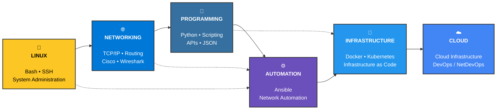

<picture align="center"></picture>

<h1 align="center"><b>Welcome to Alejandro Marrero Rojas Github Profile</b></h1>
<h2 align="center">Fourth-year Telecommunications & Electronics Engineering student
</h2>

## <picture></picture> About me

Hello! My name is **Alejandro Marrero Rojas**. I am Cuban and a student of **Telecommunications and Electronics**. Here you will find a little about my professional development and where I am directing my career. If you think something here can be useful to you, feel free to take it. And if you need more information, don't hesitate to contact me.

>**I hope that you, who are reading this, just like me, achieve what you hope for, whether professionally or in life itself, and that, with God's help, we can be  proud of our work.**

 
<strong>A hug. 🫂</strong>

## 🗺️ My Engineering Learning Roadmap

> From fundamentals to automation, networking and cloud infrastructure — learning by building, breaking and troubleshooting.

## 🧰 My Tech Stack

<h3 align="center">🖥️ Systems & Networking</h3>

  
  
  
  
  
  

<h3 align="center">🐍 Programming & Automation</h3> 

  
  
  
  
  

<h3 align="center">🐳 Infrastructure & Cloud</h3> 

  
  
  

## <picture></picture> Projects

<!-- START OF PROFILE STACK, DO NOT REMOVE -->
| 💻 **Technology** | 🚀 **Projects** |
| - | - |
|  | |
| | |
| | |
<!-- END OF PROFILE STACK, DO NOT REMOVE -->

## 📊 GitHub Statistics

  

  

## 🌐 Connect with Me

  
  

